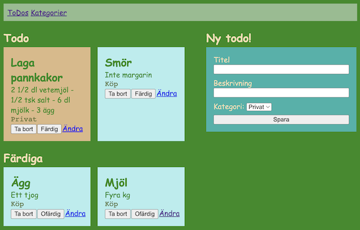

# Webbserverprogrammering 1 - Projekt #2
Enskillt projekt under andra halvan av höstterminen 2024 i kursen Webbserverprogrammering 1 på NTI Johanneberg.

## Uppgiftsbeskrivning
Andra halvan av terminen kommer du att bygga en webbapplikation med av de tekniker vi har lärt oss i kursen Webbserverprogrammering.

Under projektet kommer vi ha genomgångar för fler tekniker (som t.ex. inloggning). På vägen kommer du få kommer tips för hur du kan göra koden snyggare, bättre och lättare att hantera.

Du kan välja mellan att bygga en ___ToDo___-applikation (se bild), en ___kontaktbok___ eller en ___inköpslista___. Fråga om du har andra förslag på projekt.

  
*Exempel på hur en ToDo-applikation kan se ut*

## Specifikation
- Webbapplikation i Ruby med Sinatra och SQLite. Ni kan bygga en ToDo-applikation, Kontaktbok eller Inköpslista. Har ni andra liknande idéer så säg.
- Individuellt projekt
- Titta gärna på hur du gjorde (för att t.ex. skapa seeder-filen) i fruktprojektet.
- Skapa en användare på Github med namnet: ntijoh-fornamn-efternamn.
- Forka detta repot: https://github.com/ntijoh-ola-lindberg/wsp1-projekt2 och arbeta i de för ditt projekt.
- I slutet på varje lektion lägger ni upp koden ni skrivit till ert Github-repo
- Bjud in mig (ntijoh-ola-lindberg)
- Ni skriver i loggboken varje vecka
- Ni får feedback av mig genom hela projektet. Främst via loggbok och kanske via Github.
- Vid slutinlämning: Lämna in en liten film på classroom som visar applikationen
- Bedömning: F/E enligt beskrivning: https://github.com/ntijoh/WTF24/blob/main/Bed%C3%B6mning%20Webbserver%201.md

## Lektionsplanering

| Vecka 	| Vad                                    	    |
|-------	|---------------------------------------------|
| 45     	| Projektbeskrivning: ca 1/2 A4. Lägg i loggboken.              |
| 46     	| Korrigering projektbeskrivning + arbete     |
| 47     	| Arbete                                 	    |
| 48   	  | Arbete                              	      |
| 49     	| Arbete                                 	    |
| 50     	| Arbete                                 	    |
| 49    	| Slutinlämning                               |
| 50-51   | Feedback.  _Julavslutning  torsdagen v 51_. |

## Installation

- Ladda ner de biblotek (tex. SQLite) du behöver med `bundle` (eller `bundle install` som är samma sak)
- Starta appen med `rake dev`
- Kör seeder-filen med `rake seed`
